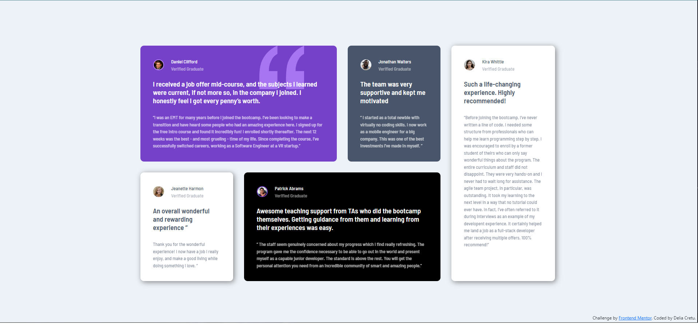

# Frontend Mentor - Testimonials grid section solution

This is a solution to the [Testimonials grid section challenge on Frontend Mentor](https://www.frontendmentor.io/challenges/testimonials-grid-section-Nnw6J7Un7). Frontend Mentor challenges help you improve your coding skills by building realistic projects.

## Table of contents

- [Overview](#overview)
  - [The challenge](#the-challenge)
  - [Screenshot](#screenshot)
  - [Links](#links)
- [My process](#my-process)
  - [Built with](#built-with)
  - [What I learned](#what-i-learned)
  - [Continued development](#continued-development)

## Overview

### The challenge

Users should be able to:

- View the optimal layout for the site depending on their device's screen size

### Screenshot

### Links

- Solution URL: https://github.com/delia-cretu/testimonials-grid-section-main
- Live Site URL: https://delia-cretu.github.io/testimonials-grid-section-main/

## My process

### Built with

- Semantic HTML5 markup
- CSS custom properties
- CSS Grid
- Flexbox

### What I learned

I used CSS Grid to create the desktop layout and Flexbox for the mobile-responsive layout which helped me gain a better understanding of both.

### Continued development

I struggled using CSS Grid to create the mobile layout which is why I chose to use Flexbox instead. I have more to learn about converting a grid layout into a 1-column layout suitable ofr mobile viewing.
